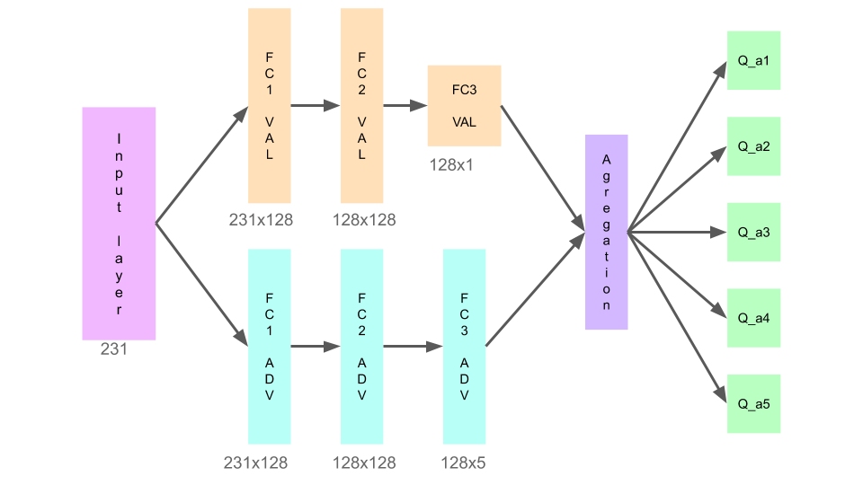
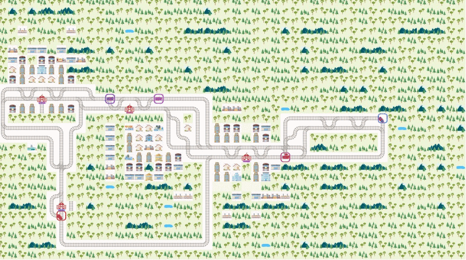
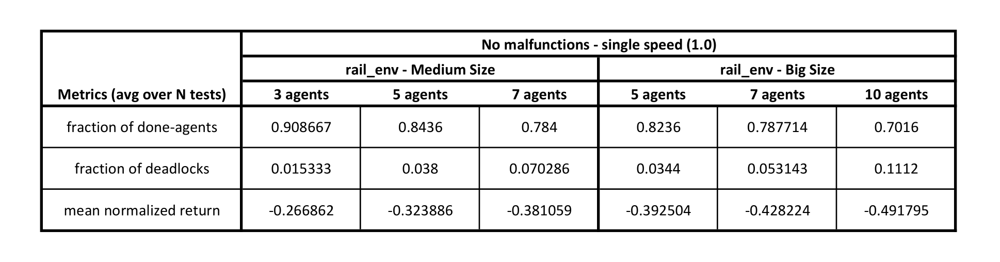

# Flatland Challenge

> The Flatland Challenge is a competition to foster progress in multi-agent reinforcement learning for any re-scheduling problem (RSP) :link: https://www.aicrowd.com/challenges/flatland-challenge.

> The repository contains our solutions with relative code to the problem presented in the challenge.

## 1. Dueling Double DQN

> The proveded solution has been developed using a Dueling Double DQN. The basic idea has been taken from the two papers :scroll: http://papers.nips.cc/paper/3964-double-q-learning.pdf :scroll: https://arxiv.org/abs/1511.06581.

## 2. Single Agent

> The first interesting solutions concentrats on the Single Agnet case, in which a single train needs to learn how to reach a target in a simple framework. Traning, tests and results using different techniques are included in the reository and discussed deeply in the [Complete Paper](Project_Flatland.pdf). 

## 3. Multi Agent

> Different methods have been used to perform training and testing from 3 up to 10 agents in different environments, including malfunctions and different velocities. For further details refer to the [Complete Paper](Project_Flatland.pdf).

## 4. Final Results
A summary of the final results obtained during the project is provided in the table:

## Contacts :speech_balloon:
The project has been developed by Giovanni Montanari, Lorenzo Sarti and Alessandro Sitta (me).

If you have any questions, feel free to ask:

:email: [alessandro.sitta@live.it](mailto:alessandro.sitta@live.it)

Github: https://github.com/alessandrositta

LinkedIn: https://www.linkedin.com/in/alessandro-sitta/
