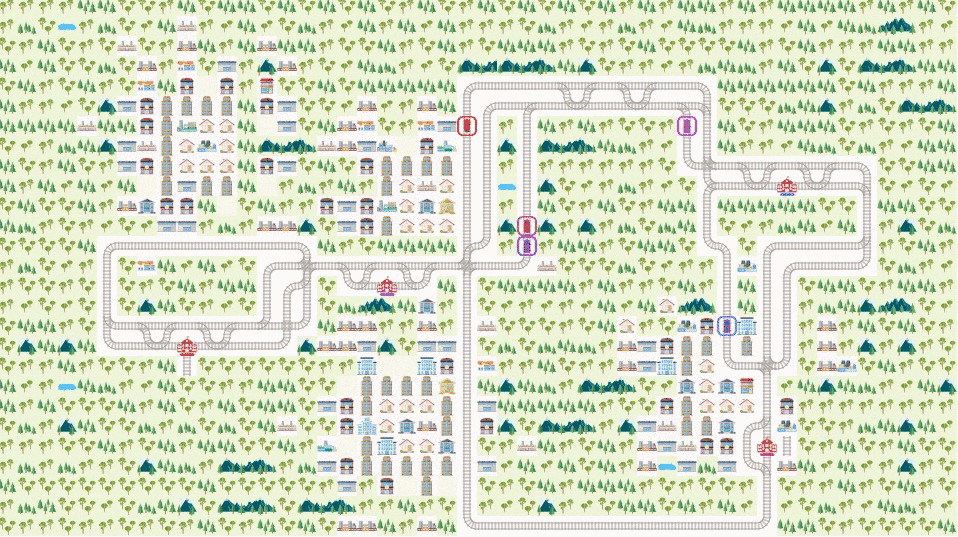
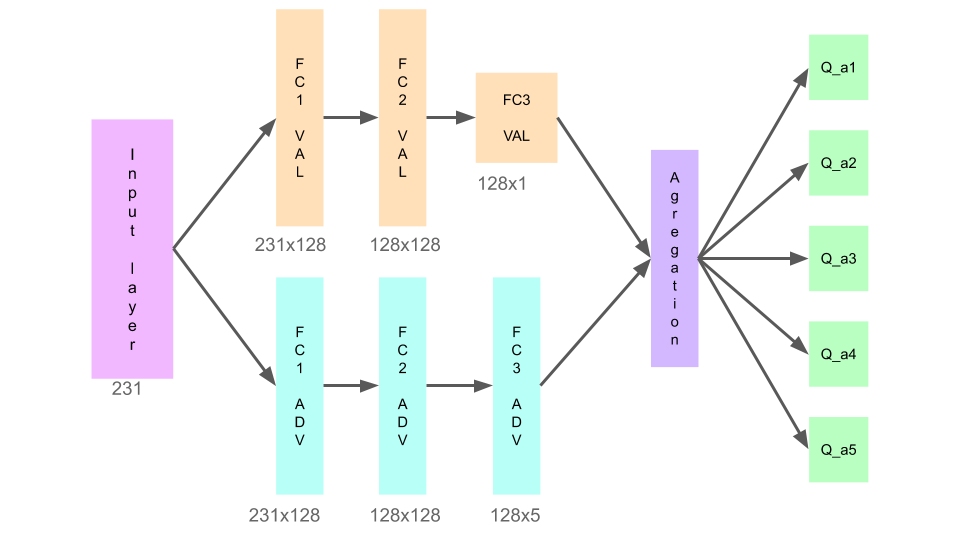
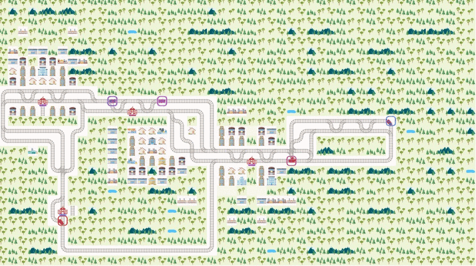
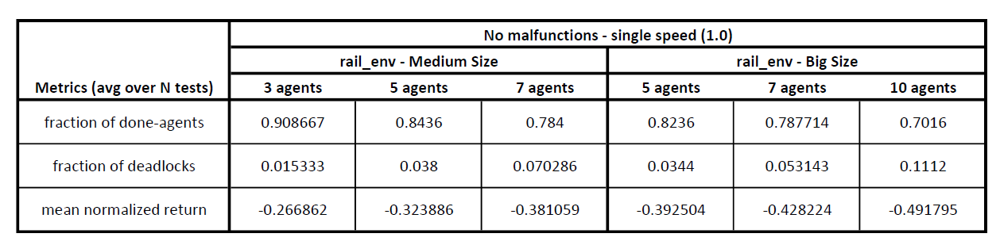
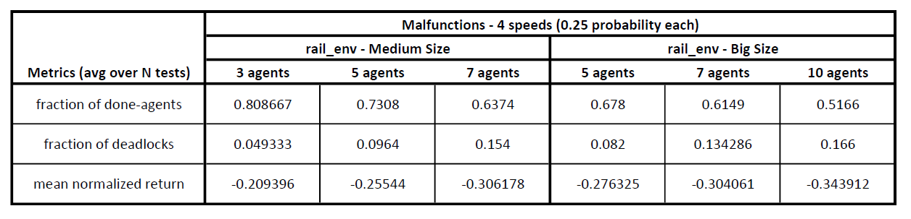
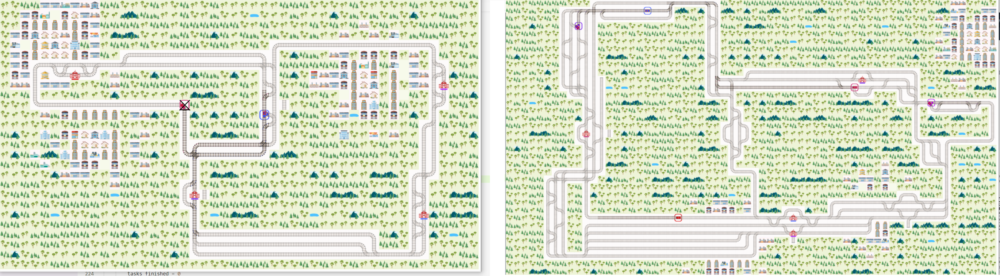

# Flatland Challenge

> The Flatland Challenge is a competition to foster progress in multi-agent reinforcement learning for any re-scheduling problem (RSP) :link: https://www.aicrowd.com/challenges/flatland-challenge.

> The repository contains our solutions with relative code to the problem presented in the challenge.

## 1. Dueling Double DQN

> The provided solution has been developed using a Reinforcement Learning approach and in particular a Dueling Double DQN. The basic idea has been taken from the two papers :scroll: http://papers.nips.cc/paper/3964-double-q-learning.pdf :scroll: https://arxiv.org/abs/1511.06581.

## 2. Single Agent

> The first interesting solutions have been developed on the Single Agnet case, in which a single train needs to learn how to reach a target in a simple framework. Traning, tests and results using different techniques are included in the reository and discussed deeply in the [Complete Paper](Flatland_Challenge_project.pdf). 

## 3. Multi Agent

> Different methods have been used to perform training and testing from 3 up to 10 agents in different environments, including malfunctions and different trains' velocities. For further details refer to the [Complete Paper](Flatland_Challenge_project.pdf).

## 4. Final Results
A summary of the final results obtained during the project is provided in the tables:

The Medium size and Big size maps are of the kind:

Further details on the dimensions and complexity of the maps as well as the metrics involved, can be found in the [Complete Paper](Flatland_Challenge_project.pdf).

## Contacts :speech_balloon:
The project has been developed by Giovanni Montanari, Lorenzo Sarti and Alessandro Sitta (me) in the context of the course "Deep Learning" at the University of Bologna.

If you have any questions, feel free to ask:

:email: [alessandro.sitta@live.it](mailto:alessandro.sitta@live.it)

Github: https://github.com/alessandrositta

LinkedIn: https://www.linkedin.com/in/alessandro-sitta/
